# BigQuery Alert Job

A one-shot Google Cloud Run Job (Python 3.11) that runs a configured list of
BigQuery queries, checks each result against a threshold, and sends **one** alert —
over **email, Slack, or both** — containing every query whose threshold was met, each
with a link to its Looker Studio dashboard so recipients can investigate further.

It is a plain script (`python main.py`) — it runs to completion and exits; it is **not**
a web server and has no HTTP endpoint. Run it on a schedule with Cloud Scheduler.

It is built to be **cloned and re-pointed** at a different GCP project, dataset, and set
of queries with **zero changes to `main.py`**.

## Why this exists

This project gives organisations **early warning when something unusual is happening in
their data**. Any company running its data in **Google BigQuery** can point this at its own
tables and get alerted the moment a metric crosses a threshold — a sudden spike or drop, a
value outside its normal range, a flag flipping to `true`.

The goal is to **catch peculiarities while they're still small**. Instead of an anomaly
quietly compounding until it's a costly, hard-to-untangle problem, the right people are
notified straight away (in their inbox or Slack) with the exact rows and a dashboard link —
so they can investigate and fix the issue quickly, before it grows.

Run it on a schedule (e.g. hourly or daily via Cloud Scheduler) and it becomes a
lightweight, always-on monitor sitting on top of your existing BigQuery tables.

## Output


## How it works

Each execution (`main()` → `run_pipeline()`) runs the whole pipeline top to bottom:

1. **Load config** — `load_config()` reads `config.json`: the `dataset`, optional
   `project_id`, the `email` and/or `slack` notification blocks, and the `queries` list.
2. **Open BigQuery** — `bigquery.Client(project=...)`. If `project_id` is `null`, it
   uses the ambient project (the function's service account when deployed).
3. **Loop over each query, in config order:**
   - **Skip if no condition** — a query without a `condition` is skipped (not run),
     because an alert only ever reports genuine matches.
   - **Render SQL** — `render_sql()` reads the `.sql` file and replaces every
     `{{dataset}}` placeholder with the configured dataset (this is what makes the
     queries portable across projects).
   - **Run it** — `client.query(sql).result()` executes on BigQuery.
   - **Filter by condition** — `row_meets_condition()` keeps rows where the condition
     holds. Matching rows are collected together with the query's `dashboard_url`.
4. **Decide & send** — after all queries run:
   - If **≥1** query produced matching rows → the `triggered` list is sent to every
     **enabled** channel (one message per channel, one table/section per query):
     - **Email** → `build_email_html()` composes a single HTML email (one table per query,
       each with its dashboard link) → `send_email()` sends it via Gmail SMTP
       (`smtp.gmail.com:587`, STARTTLS).
     - **Slack** → `build_slack_message()` composes a Block Kit message (one monospace
       table per query plus the dashboard link) → `send_slack()` POSTs it to the
       Incoming Webhook.
   - If **nothing** matched → **no message is sent** (no "all clear" summary).
5. **Exit** — the script exits `0` on success. On any error it prints to stderr and
   exits non-zero, so the Cloud Run Job execution is marked **Failed** in the logs.

### Pipeline diagram

```mermaid
flowchart TD
    A([Job execution starts]) --> B[load_config<br/>read config.json]
    B --> C[Create BigQuery client<br/>project_id or ambient default]
    C --> D{More queries<br/>in config?}

    D -- yes --> G{Has condition?}
    G -- no --> S[skip query] --> D
    G -- yes --> E[render_sql<br/>substitute &#123;&#123;dataset&#125;&#125;]
    E --> F[client.query .result<br/>run on BigQuery]
    F --> I[row_meets_condition<br/>keep matching rows]
    I --> K{Any rows matched?}
    K -- yes --> L[add to triggered:<br/>name, dashboard_url, rows]
    K -- no --> D
    L --> D

    D -- no --> M{triggered<br/>not empty?}
    M -- yes --> N[for each enabled channel<br/>build message + send]
    N --> N1[email: build_email_html<br/>send_email Gmail SMTP 587]
    N --> N2[slack: build_slack_message<br/>send_slack Incoming Webhook]
    N1 --> P([exit 0<br/>alert sent])
    N2 --> P
    M -- no --> Q([exit 0<br/>no conditions met, no alert])

    F -. exception .-> R([print to stderr<br/>exit 1, execution Failed])
    N1 -. exception .-> R
    N2 -. exception .-> R
```



## Configuration

All project-specific values live in `config.json` (see `config.example.json` for a
fuller template).

| Field | Notes |
|-------|-------|
| `project_id` | `null` = use ambient/default GCP project; or a project ID string |
| `dataset` | Substituted into every `{{dataset}}` placeholder in the SQL files |
| `email` | *Optional* email channel block — omit (or `"enabled": false`) to skip email |
| `email.recipients` | List of recipient addresses |
| `email.subject` | Email subject line |
| `slack` | *Optional* Slack channel block — omit (or `"enabled": false`) to skip Slack |
| `slack.header` | *Optional* header text shown at the top of the Slack message |
| `queries[].name` | Heading shown above that query's table |
| `queries[].file` | SQL filename inside `SQL/` |
| `queries[].dashboard_url` | *Optional* Looker Studio link rendered under the table |
| `queries[].condition` | Threshold that selects alerting rows — see below |

### Conditions

A `condition` selects which rows count as alerts. Two forms:

- **Comparison** — `{"column": ..., "operator": ..., "value": ...}` with one of
  `>` `>=` `<` `<=` `==` `!=`. Example: `{"column": "percent_change", "operator": ">=", "value": 5}`.
- **Boolean column** — `{"column": ..., "operator": "is_true"}` or `"is_false"`. No
  `value` needed; matches rows where the BOOL column is exactly true / false. Example:
  `{"column": "is_alert", "operator": "is_true"}`.

**An alert is sent only if at least one query has rows that meet its condition** — nothing
goes out when nothing is flagged. A query with **no** `condition` is skipped entirely (not
run, not alerted), so every query that should matter needs one. Omit `dashboard_url` to
render a query's table with no link.

> ⚠️ **Keep query result sets small.** The condition is evaluated against **every row**
> the query returns, and **every matching row is included in the alert**. Write each query
> to return only the row(s) you actually want to alert on — e.g. the most recent day via
> `ORDER BY ... LIMIT 1` or a `WHERE` clause. A query that returns thousands of rows will
> alert if *any* one of them matches and send all the matches.

### Notification channels

Alerts go to **email**, **Slack**, or **both** — whichever channels are enabled in
`config.json`. A channel is **enabled when its block is present** and not explicitly
disabled; set `"enabled": false` to keep the config but turn the channel off. The two
channels are independent, so you can run either, both, or (by disabling both) neither.

```jsonc
"email": {
  "enabled": true,                       // optional; present == enabled
  "recipients": ["alice@example.com"],
  "subject": "BigQuery alert: thresholds triggered"
},
"slack": {
  "enabled": true,
  "header": "🚨 BigQuery alert: thresholds triggered"   // optional
}
```

**Slack only (email disabled).** To send to Slack and skip email, set `"enabled": false`
on the `email` block (or remove it entirely) — the email config stays in the file but
dormant:

```jsonc
"email": {
  "enabled": false,                      // dormant: no email is sent
  "recipients": ["alice@example.com"],
  "subject": "BigQuery alert: thresholds triggered"
},
"slack": {
  "enabled": true,
  "header": "🚨 BigQuery alert: thresholds triggered"
}
```

Each channel reads its own secret from the environment (`GMAIL_ADDRESS` /
`GMAIL_APP_PASSWORD` for email, `SLACK_WEBHOOK_URL` for Slack) — only set the secrets for
the channels you enable. Slack uses an **Incoming Webhook**, so the message always posts to
the single channel that webhook is bound to; pick the destination when you create the
webhook in Slack.

## Secrets

Set via env vars (never commit them) — see `.env.example`. Only the enabled channels need
their secrets:

- `GMAIL_ADDRESS` — sender Gmail address *(email)*
- `GMAIL_APP_PASSWORD` — 16-char Gmail **App Password**, requires 2-Step Verification *(email)*
- `SLACK_WEBHOOK_URL` — Slack [Incoming Webhook](https://api.slack.com/messaging/webhooks)
  URL for the destination channel *(Slack)*

## Run locally

```powershell
.venv\Scripts\Activate.ps1
pip install -r requirements.txt
$env:GMAIL_ADDRESS="you@gmail.com"; $env:GMAIL_APP_PASSWORD="app-password"
$env:SLACK_WEBHOOK_URL="https://hooks.slack.com/services/..."   # only if Slack is enabled
python main.py
```

It runs once and exits — no server, no URL to hit. Authenticate to BigQuery first with
`gcloud auth application-default login` (or point `GOOGLE_APPLICATION_CREDENTIALS` at a
service-account key).

## Deploy

The deployed pipeline is three GCP pieces working together:

1. **Cloud Build** builds the Docker image. The repo ships a `Dockerfile`
   (`CMD ["python", "main.py"]`); Cloud Build turns it into a container image in Artifact
   Registry. Connect a **Cloud Build trigger** to this repo so the image is **rebuilt after
   every push**.
2. **Cloud Run Job** executes the image Cloud Build produced. It runs the container to
   completion and exits — there is no served URL. The notification secrets for the enabled
   channels (Gmail and/or `SLACK_WEBHOOK_URL`) are configured on the job.
3. **Cloud Scheduler** triggers the job on **the desired routine** (Cloud Run Jobs have a
   built-in scheduler trigger), so the queries run on a cron schedule.

```
 git push ──► Cloud Build (build image) ──► Cloud Run Job (run main.py) ◄── Cloud Scheduler (cron)
```

Deploy / redeploy the job from source (Cloud Build performs the image build):

```powershell
gcloud run jobs deploy bq-alert-job --source . --region <region> `
  --set-env-vars GMAIL_ADDRESS=you@gmail.com,GMAIL_APP_PASSWORD=app-password,SLACK_WEBHOOK_URL=https://hooks.slack.com/services/...
```

Run it on demand with `gcloud run jobs execute bq-alert-job --region <region>`.

For production, prefer Secret Manager (`--set-secrets`) over `--set-env-vars` for the
password and webhook URL.

### Clone into Cloud Shell

The quickest way to deploy is from [Cloud Shell](https://shell.cloud.google.com) (it has
`gcloud`, `git`, and Docker pre-installed). Clone the repo and `cd` in:

```bash
git clone https://github.com/Ethan07914/gc-alert-run-function.git
cd gc-alert-run-function
```

Then run the `gcloud run jobs deploy` command above.

### Rebuild the image in Cloud Build

`gcloud run jobs deploy --source .` already invokes Cloud Build to rebuild the image on
every deploy. To rebuild the image **on its own** (e.g. after editing a query) without
redeploying the job, submit the build directly — it builds the `Dockerfile` and pushes to
Artifact Registry:

```bash
gcloud builds submit --tag <region>-docker.pkg.dev/<project>/<repo>/bq-alert-job .
```

If you've connected a **Cloud Build trigger** to this repo, every `git push` rebuilds the
image automatically; you can also fire the trigger manually:

```bash
gcloud builds triggers run <trigger-name> --branch=main
```

## Reusing on another project

1. Edit `config.json` — new `dataset`, `queries`, and the `email`/`slack` blocks for the
   channels you want.
2. Replace the files in `SQL/`, referencing tables as `` `{{dataset}}.table` ``.
3. Set the secret env vars for the enabled channels (`GMAIL_*` and/or `SLACK_WEBHOOK_URL`).

`main.py` stays untouched.
